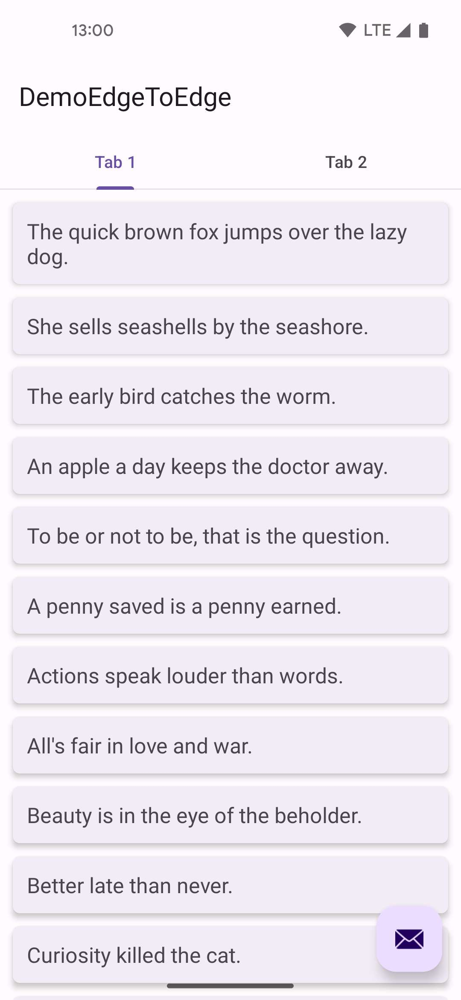
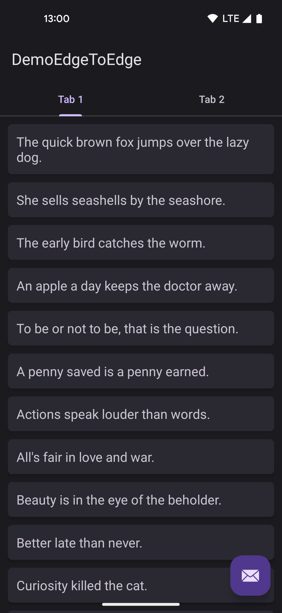
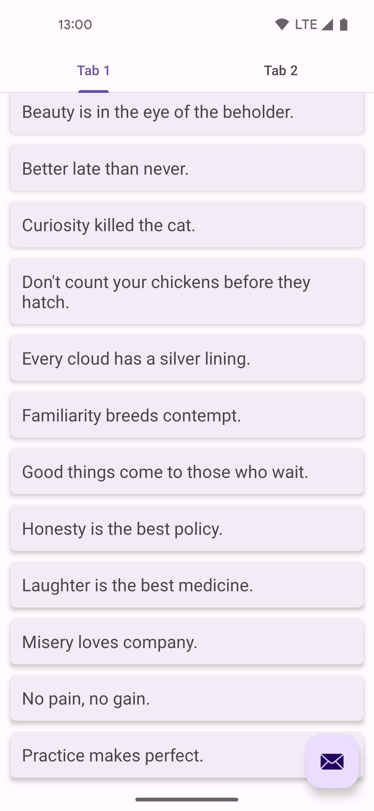
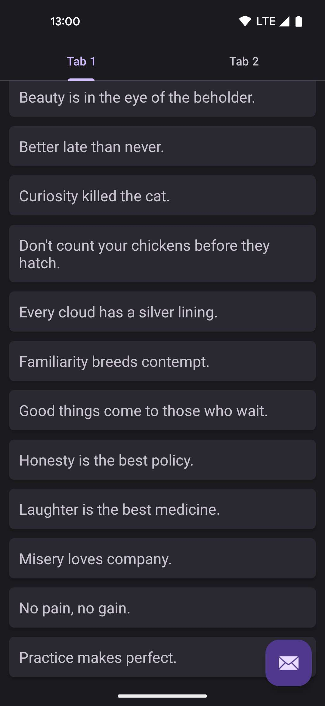
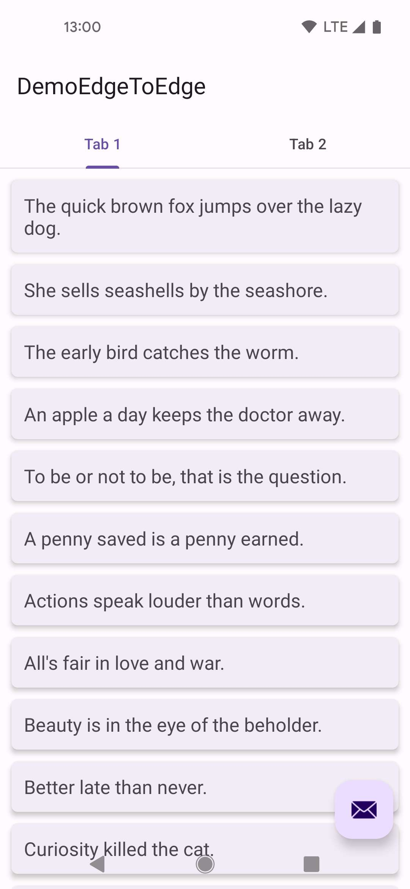
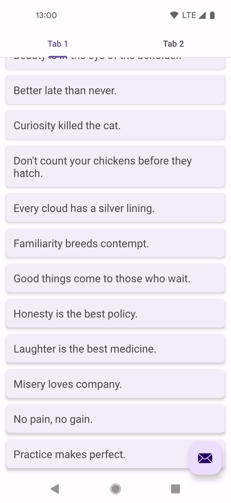
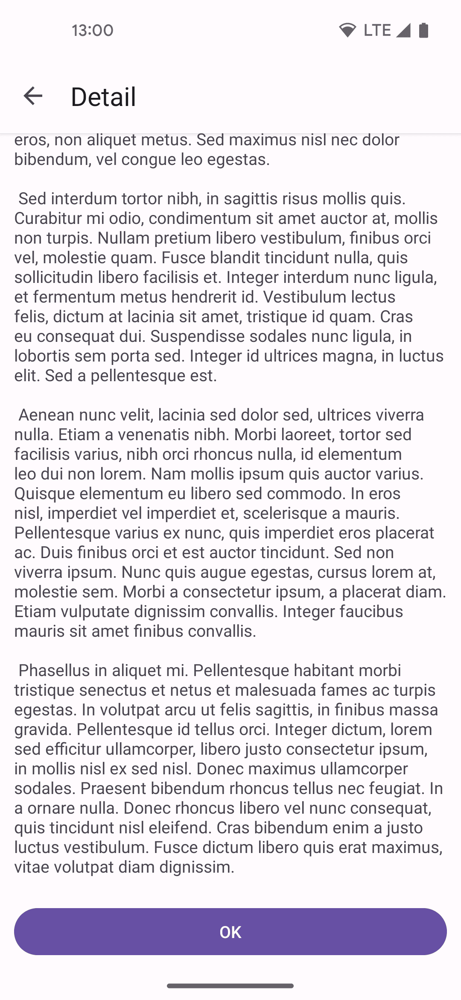
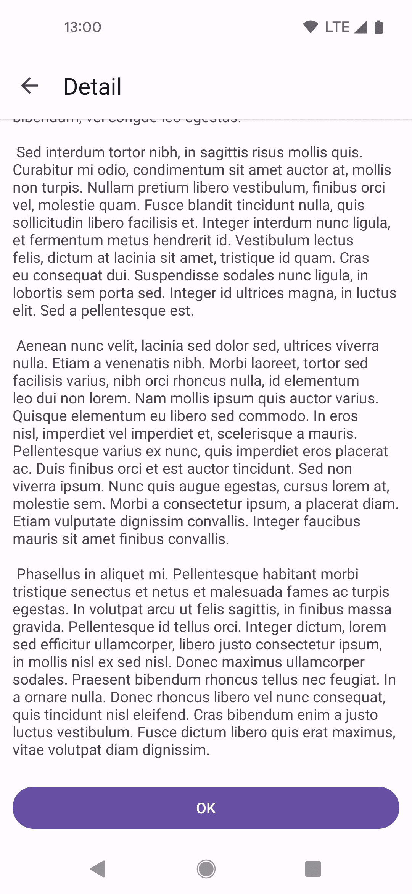

An Android demo app about how to Display content edge-to-edge.

# Home page: 

 

 

## 3-button-navi
 

# Detail page

 

# Thanks:
[material-components: catlog App](https://github.com/material-components/material-components-android/tree/master/catalog)

[WindowInsets — listeners to layouts](https://github.com/material-components/material-components-android/tree/master/catalog
https://medium.com/androiddevelopers/windowinsets-listeners-to-layouts-8f9ccc8fa4d1 )

