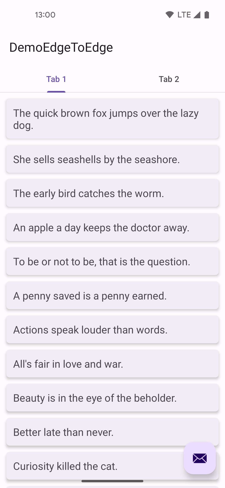
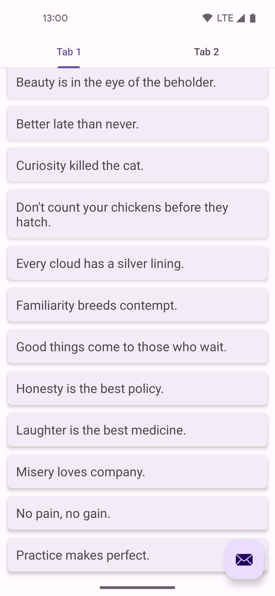
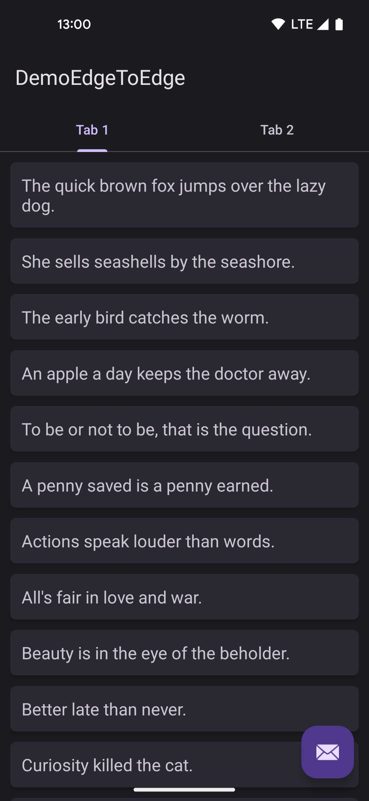
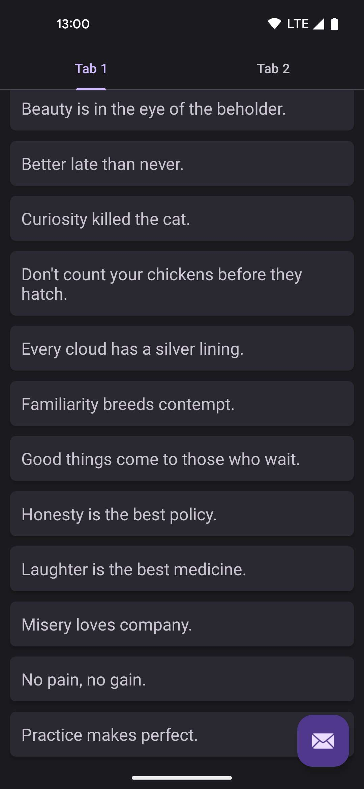
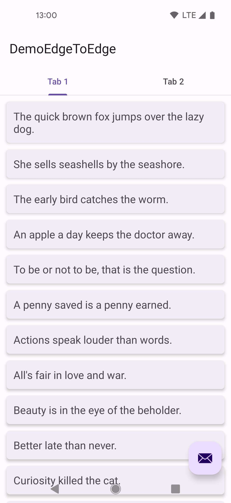

# sample-android-edge-to-edge

## Gesture navigation mode

### Day theme

### Night theme

## 3-button navigation mode

### Day theme

Thanks to https://github.com/material-components/material-components-android/tree/master/catalog